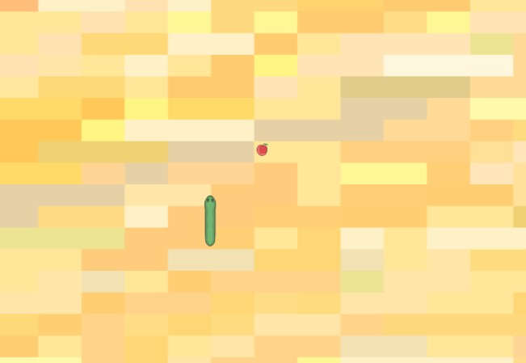

# Игровой процесс
### Начало игры:
Игрок открывает страницу с игрой и видит игровое поле с змеей и яблоком.
На экране присутствует кнопка для перехода в полноэкранный режим.

### Игровой процесс:
Игрок управляет змеей при помощи клавиш клавиатуры.
Змея перемещается по игровому полю, пытаясь съесть яблоко.
Если змея съедает яблоко, ее длина увеличивается, и игрок получает очки.
Если змея сталкивается с границами поля или самой собой, игра завершается.

### Завершение игры 
При завершении игры появляется модальное окно с результатами: текущим счетом и рекордом.
Игрок может начать игру заново, нажав соответствующую кнопку в модальном окне.

### Дополнительные возможности:
В игре реализован механизм замедления кадров для более плавного движения змеи.
Рекорд игрока сохраняется, и если текущий счет превышает рекорд, рекорд обновляется.

### Полноэкранный режим:
Игрок может перейти в полноэкранный режим, чтобы улучшить игровой опыт.

_Хотелки:_
- [ ] Реализовать мультиплеер для совместной игры (2 и более игроков);
- [ ] Добавить случайный выбор фона для игрового поля;
- [ ] Добавление кнопок паузы и продолжения: Реализуйте кнопки для паузы и продолжения игры.

