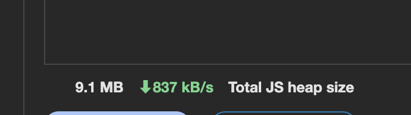
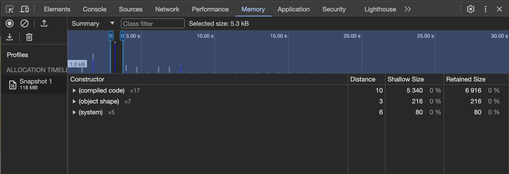
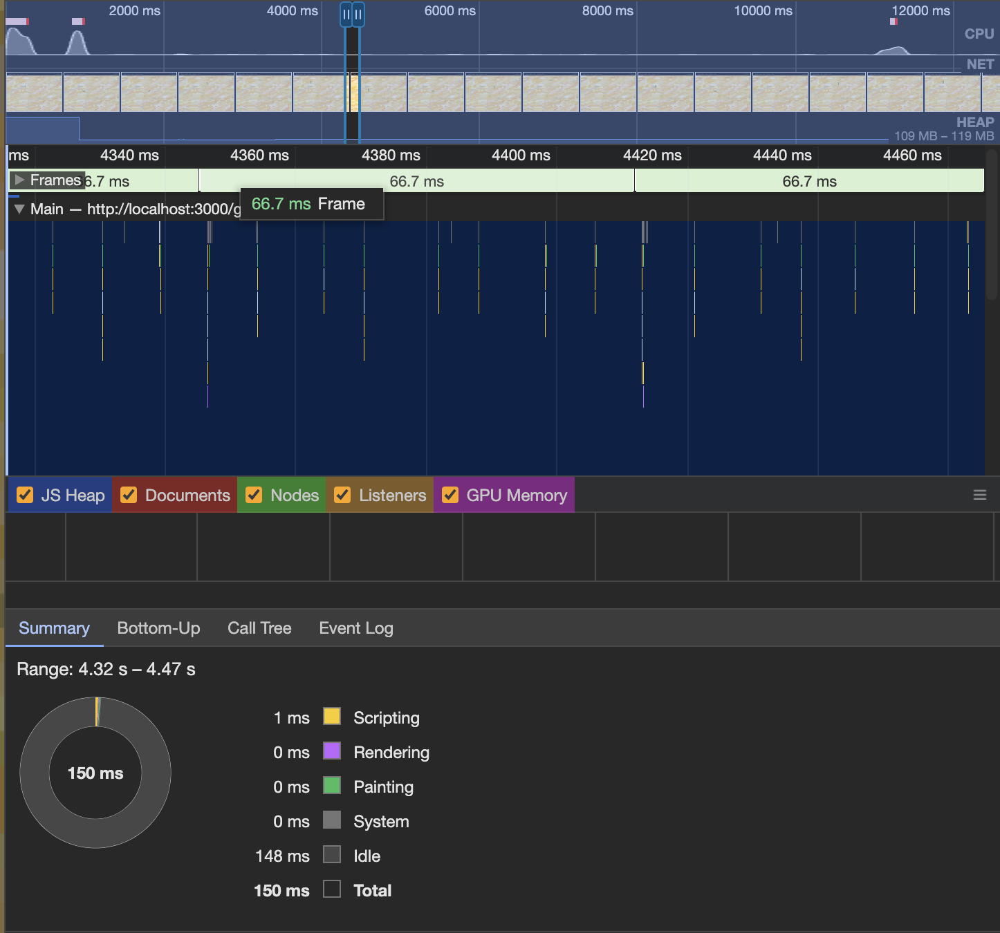
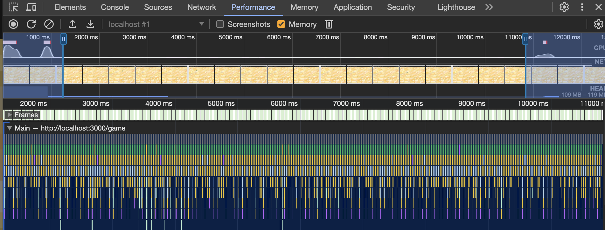

# Утечки памяти

На возможные утечки была проанализирована вкладка с игрой.
Игра запускалась в инкогнито-режиме для исключения влияния сторонних расширений.

### Вкладка Memory

Был написан скрипт эмулирования действий игрока (змейка ползала по кругу), и анализировался размер потребляемой памяти.
На протяжении 30 минут работы скрипта память не изменялась.

Так же было сделано несколько снепшотов памяти для поиска detached Dom elements. Таких элементов обнаружено не было.

### Вкладка Performance

Была сделана запись производительности страницы. На ней также видно что размер heap не увеличивается, остается на одном уровне, количество кадров стабильное. CPU throttling картину не менял.

### Выводы

На основании всего выше перечисленного был сделан вывод что утечек в нашей игре нет.
